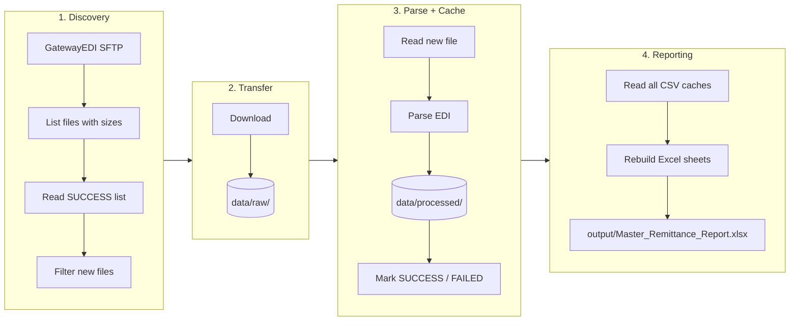

# EDI 835 Remittance Processing Pipeline

An automated, cross-platform Python pipeline that connects to an EDI 835 SFTP server, downloads `.rmt` files, performs incremental segment-level parsing, and generates a structured two-sheet Excel report. 

This pipeline is designed for a home healthcare provider and features **local state tracking** via SQLite to prevent processing duplicate files on read-only SFTP servers, along with a **built-in background scheduler**.

---

## System Architecture

> **Note:** For a detailed breakdown of the data transformation processes and how this pipeline fits into the broader end-to-end reconciliation ecosystem, please see [docs/workflow.md](docs/workflow.md).



---

## Setup & Installation

### 1. Prerequisites
- Python 3.9+ installed on your system.
- [`uv`](https://docs.astral.sh/uv/) package manager (fast, reliable dependency management).

### 2. Install Dependencies
Run this command from the project root to automatically spin up a virtual environment (`.venv/`) and download all locked dependencies:
```bash
uv sync
```

### 3. Configuration
1. Copy the template configuration file:
   ```bash
   cp .env.example .env
   ```
2. Open `.env` and fill in the credentials:
   ```env
   SFTP_HOST=sftp.gatewayedi.com
   SFTP_PORT=22
   SFTP_USERNAME=54L7
   SFTP_PASSWORD=
   SFTP_REMOTE_DIR=/remits
   
   FILE_EXISTS_BEHAVIOR=skip
   ```

---

## 🛠 Operation Manual (Background Server Management)

This pipeline features a built-in background scheduler that polls the server every hour. Use the commands below to easily manage this service on your machine:

### Start the Background Server
Launches the scheduler loop in the background, redirecting logs to `logs/scheduler.log`:
*   **Linux / macOS:**
    ```bash
    nohup uv run python main.py --scheduler > logs/scheduler.log 2>&1 &
    ```
*   **Windows (Command Prompt):**
    ```cmd
    start /B uv run python main.py --scheduler > logs\scheduler.log 2>&1
    ```

### Check if the Server is Running
*   **Linux / macOS:**
    ```bash
    ps aux | grep "main.py --scheduler" | grep -v grep
    ```

### Stop/Kill the Background Server
*   **Linux / macOS:**
    ```bash
    pkill -f "main.py --scheduler"
    ```
*   **Windows:**
    Find the PID using task list and terminate it:
    ```cmd
    taskkill /F /IM python.exe
    ```

### View Live Execution Logs
Print the live output to monitor execution (e.g. downloads, parsing counts, errors):
*   **Linux / macOS:**
    ```bash
    tail -f logs/scheduler.log
    ```

### Check Processed Files (Last 24 Hours)
Query the SQLite database to see exactly what files have been ingested:
```bash
sqlite3 data/pipeline_state.db "SELECT filename, file_size, processed_at, status FROM processed_files WHERE processed_at >= datetime('now', '-1 day') ORDER BY processed_at DESC;"
```

---

## Command Line Interface (CLI)

For manual control, you can execute individual components in one-shot foreground mode.

| Command | Action |
| :--- | :--- |
| `uv run python main.py` | Runs the full pipeline once (SFTP -> Parse -> Excel output). |
| `uv run python main.py --parse-only` | Skips SFTP download; checks local `data/raw/` for new files, parses, and rebuilds the report. |
| `uv run python main.py --download-only` | Connects to SFTP, downloads new files to `data/raw/`, updates DB state, then exits. |
| `uv run python main.py --output-dir ./my_reports/` | Directs the final Excel output to a custom directory. |
| `uv run python main.py --help` | Display CLI options and examples. |

---

## Excel Output Format

The output Excel report consists of two sheets:

### Sheet 1: `Claim Summary`
Aggregated at the Claim Level (`CLP` segment) for high-level management:
- **Base Columns (1–22):** Exactly matches historical template layout (`Batch`, `Date`, `Claim`, `Transaction Type`, `Charge`, `Payment`, `Allowed`, etc.).
- **Procedure Code:** Formats and aggregates primary procedure codes and modifiers (e.g., `T1005: 76`) from underlying service lines to indicate the care type.
- **Billed/Paid Hours:** Summarized from actual service-line units.
- **Has Adjustment / Total Adjustment / Adjustment Codes:** Identifies claims with financial adjustments (e.g., `OA-23`, `PR-142`) and shows totals.
- **Service Lines:** The count of daily lines rolled up into this claim.

### Sheet 2: `Service Line Detail`
Granular line-level details (`SVC` segment) for audit and reconciliation:
- **Check/EFT Number / Date / Patient Name / Member ID / TCN** for easy lookups.
- **Line-level values:** `Billed Amount`, `Paid Amount`, and `Line Allowed Amount (B6)` (parsed from `AMT*B6`).
- **Adjustments (CAS1-CAS3):** Dynamic columns showing group code, reason code, and amount for each adjustment segment.
- **Remark Codes:** Displays remark/error details parsed from `MOA` or `LQ` segments.
