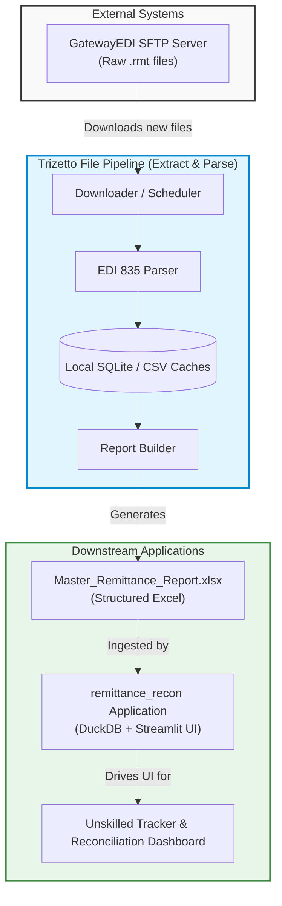
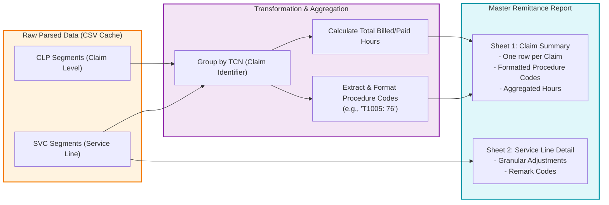

# EDI 835 Remittance Pipeline Workflows

This document outlines the detailed workflows and data pipelines for the EDI 835 Remittance processing system, from raw file ingestion to downstream reconciliation.

## 1. End-to-End Ecosystem

The `trizetto_file` repository is the first step in a larger reconciliation ecosystem. It connects to the clearinghouse (GatewayEDI), parses raw EDI 835 files, and outputs a structured Excel report that serves as the source of truth for downstream reconciliation systems (like the `remittance_recon` tool).

## 2. Report Builder Data Flow

The Reporting module (`report_builder.py`) contains complex logic to transform raw EDI segments into business-readable summaries. A critical component is rolling up service lines into a claim summary and handling procedure code extraction with modifiers.

